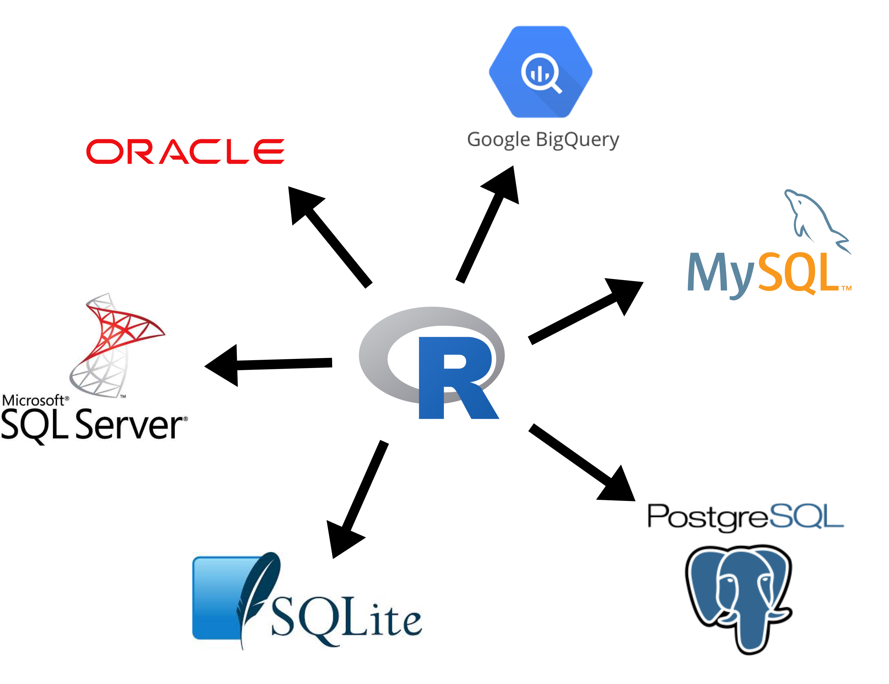
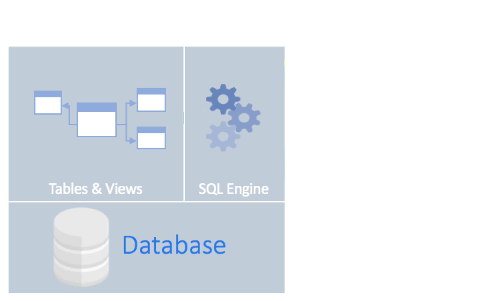
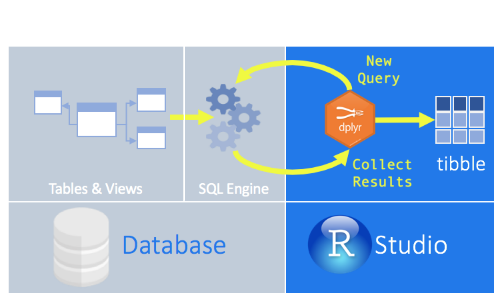
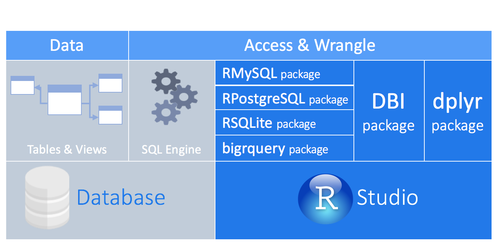

## What are we learning?

.pull-left[
**Objectives for this lesson are:**

1. To access a database from within R.
2. To execute SQL queries in R using `dplyr`.
]

.pull-right[

]

---

## What are we learning?
.pull-left[
**Objectives for this lesson are:**

1. To access a database from within R.
2. To execute SQL queries in R using `dplyr`.

</br></br></br>

## Why?

**What do you think?**
]

.pull-right[

]

---
## What are we learning?
.pull-left[
**Objectives for this lesson are:**

1. To access a database from within R.
2. To execute SQL queries in R using `dplyr`.

</br></br></br>

## Why?

- Your data is already in a database.
- You have too much for your computer's memory to handle at once.
- Retrieve only what you need.
- All of your code is in R! :)
]

.pull-right[

]
---
class: section, center, middle
# 1. Connect to a database

---
## Connect to a database
### Many different databases

<center></center>
---
## Connect to a database

### Common databases have R packages

<center></center>
---
## Connect to a database

### Using *dplyr*

<center></center>

---
## Connect to a database
### Using *dplyr*

<center></center>

---
## Connect to a database

### Using *dplyr*
<center></center>

```
install.packages("dbplyr")
```
---
## Connect to a database

### `DBI` package
</br>
<center></center>

---
## Connect to a database

### Create the connection

```{r eval = FALSE}
library(dplyr)
library(dbplyr)

con <- DBI::dbConnect(RSQLite::SQLite(), path = ":dbname:")

```

--
A more realistic connection:

```{r eval = FALSE}
con <- DBI::dbConnect(RMySQL::MySQL(), 
                      dbname = "my_database"
                      host = "database.lsdkjfslfj.uk-west-1.rds.amazonaws.com",
                      user = "student",
                      password = "my_password")
```

---
## Check your understanding

What is the most likely output from running the following piece of code and why?

```{r eval = FALSE}
library(dplyr)

con <- DBI:dbConnect(RSQLite::SQLite(), "data_raw/mammals.sqlite")

data <- tbl(con, "species") 

nrow(data)
```

1. `NA` - as the `species` table is empty and therefore the `data` dataframe is empty.
2. `NA` - as `dplyr is lazy and only pulls the data into R when explicitly asked.
3. `54` - as we have created a `data` dataframe in R from the `species` table in the database, which has 54 rows.

---
class: section, center, middle
# 2. Query a database

---
## Query a database

### Using the `dplyr` syntax

Behind the scenes, `dbplyr` and `dplyr`:

- translates R into SQL
- submits to database
- translates response from database into a R dataframe

Focus on `SELECT`.

---
## Check your understanding

Arrange the following steps in the correct order to find out the number of animals surveyed per year in the mammals database.

.pull-left[
```
1. Use `tbl` to create a reference to the `surveys` table.
2. `group_by` the year. 
3. Create a connection to the database.
4. `collect` the data.
5. `summarise` by counting the number of observations in each group.
```
]

---
## Check your understanding

Answer:

.pull-left[
```
3. Create a connection to the database.
1. Use `tbl` to create a reference to the `surveys` table.
2. `group_by` the year. 
5. `summarise` and count the number of observations in each group.
4. `collect` the data.
```
]

.pull-right[
```
mammals <- DBI::dbConnect(RSQLite::SQLite(), "data_raw/mammals.sqlite")

year_summary <- tbl(mammals, "surveys")
  group_by(year) %>%
  summarise(N = n()) %>%
  collect()
                
```
]
---

class: section, center, middle
# 3. Let's practice!

---
## Attribution

### Images:
- database by Lnhi from the Noun Project - https://thenounproject.com/search/?q=database&i=2220445
- Databases using R from RStudio - https://db.rstudio.com/overview

### Content:

Inspiration from the following websites, articles and courses:

- https://db.rstudio.com/
- https://datacarpentry.org/R-ecology-lesson/index.html
- https://www.r-bloggers.com/a-comprehensive-introduction-to-working-with-databases-using-r/

### Data:

```
download.file(url = "https://ndownloader.figshare.com/files/2292171",
              destfile = "mammals.sqlite", mode = "wb")
```
---
