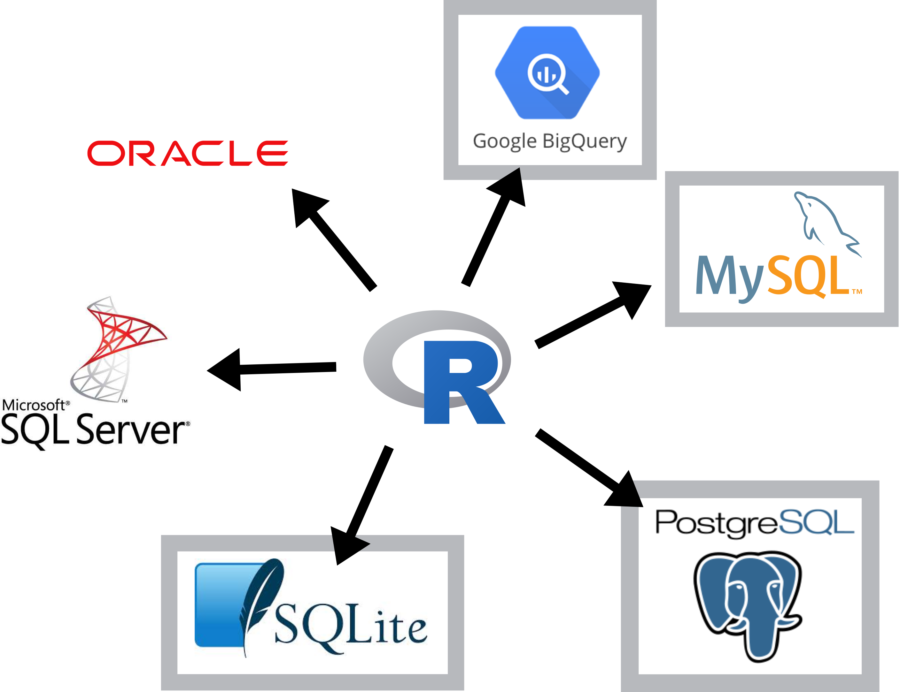
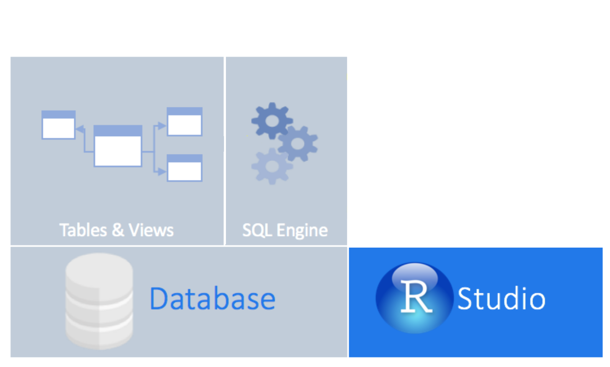

## What are we learning?

.pull-left[
**Objectives for this lesson are:**

1. To access a database from within R.
2. To execute SQL queries in R using `dplyr`.
]

.pull-right[

]

---

## What are we learning?
.pull-left[
**Objectives for this lesson are:**

1. To access a database from within R.
2. To execute SQL queries in R using `dplyr`.

</br></br></br>

## Why?

**What do you think?**
]

.pull-right[

]

---
## What are we learning?
.pull-left[
**Objectives for this lesson are:**

1. To access a database from within R.
2. To execute SQL queries in R using `dplyr`.

</br></br></br>

## Why?

- Your data is already in a database.
- You have too much for your computer's memory to handle at once.
- Retrieve only what you need.
- All of your code is in R! :)
]

.pull-right[

]
---
## Connect to a database

### Many different databases

<center></center>
---
## Connect to a database

### Common databases have R packages

<center></center>
---
## Connect to a database

### Using *dplyr*

<center></center>

---
## Connect to a database
### Using *dplyr*

<center></center>

---
## Connect to a database

### Using *dplyr*
<center></center>

```
install.packages("dbplyr")
```

---
## Connect to a database

### `DBI` package
<center></center>

---
## Attribution

### Images:
- database by Lnhi from the Noun Project - https://thenounproject.com/search/?q=database&i=2220445
- Databases using R from RStudio - https://db.rstudio.com/overview

### Content:

Inspiration from the following websites, articles and courses:

- https://db.rstudio.com/
- https://datacarpentry.org/R-ecology-lesson/index.html
- https://www.r-bloggers.com/a-comprehensive-introduction-to-working-with-databases-using-r/
- 
