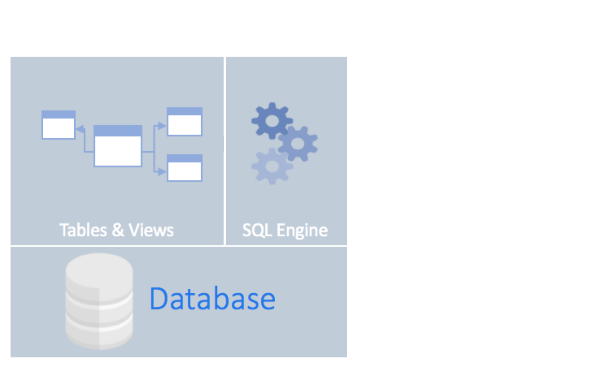
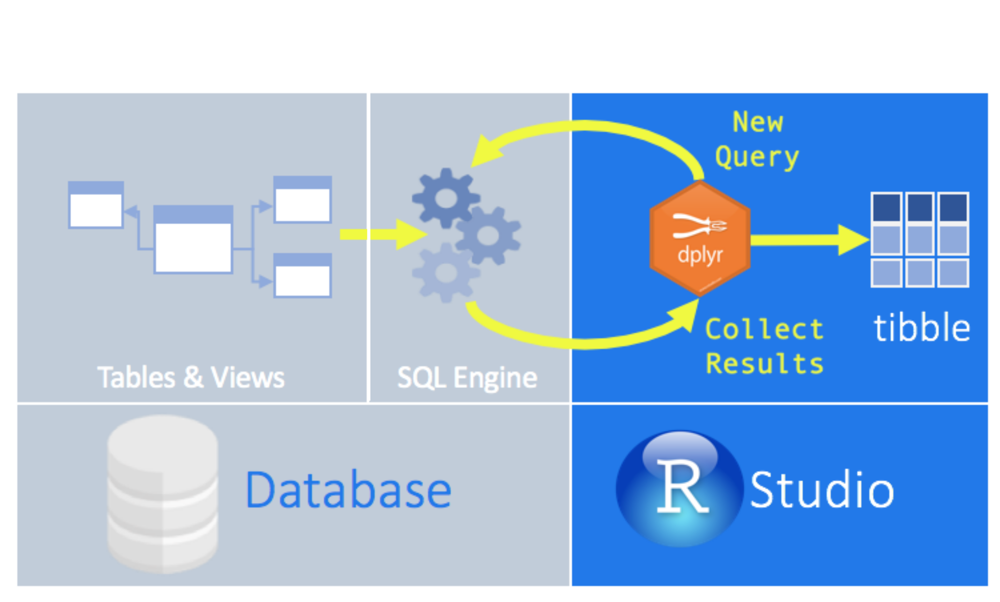
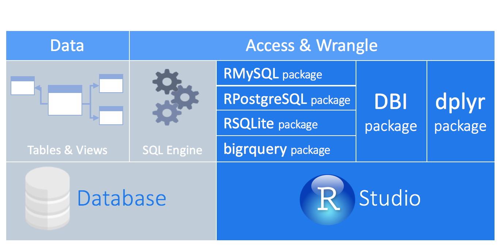

```{r setup, include=FALSE}
options(tibble.print_min = 5)
knitr::opts_chunk$set(echo = TRUE, warning=FALSE,  message=FALSE, fig.retina = 3, comment = NULL)

library(dplyr)
library(dbplyr)
```
## What are we learning?

.pull-left[
**Objectives for this lesson are:**

1. To access a database from within R.
2. To execute SQL queries in R using `dplyr`.
]

.pull-right[

]

---

## What are we learning?
.pull-left[
**Objectives for this lesson are:**

1. To access a database from within R.
2. To execute SQL queries in R using `dplyr`.

</br></br></br>

## Why?

**What do you think?**
]

.pull-right[

]

---
## What are we learning?
.pull-left[
**Objectives for this lesson are:**

1. To access a database from within R.
2. To execute SQL queries in R using `dplyr`.

</br></br></br>

## Why?

- Your data is already in a database.
- You have too much for your computer's memory to handle at once.
- Retrieve only what you need.
- All of your code is in R! :)
]

.pull-right[

]
---
class: section, center, middle
# 1. Connect to a database

---
## Connect to a database
### Many different databases

<center></center>
---
## Connect to a database

### Common databases have R packages

<center></center>
---
## Connect to a database

### Using *dplyr*

<center></center>

---
## Connect to a database
### Using *dplyr*

<center></center>

---
## Connect to a database

### Using *dplyr*
<center></center>

```
install.packages("dbplyr")
```
<!-- --- -->
<!-- ## Connect to a database -->

<!-- ### `DBI` package -->
<!-- </br> -->
<!-- <center></center> -->

---
## Connect to a database

### Create the connection

```{r eval = FALSE}
library(dplyr)
library(dbplyr)

con <- DBI::dbConnect(RSQLite::SQLite(), path = "data/my_database.sqlite")

```

--
</br>

A more realistic connection to a database on a server:

```{r eval = FALSE}
con <- DBI::dbConnect(RMySQL::MySQL(), 
                      dbname = "my_database"
                      host = "database.lsdkjfslfj.uk-west-1.rds.amazonaws.com",
                      user = "student",
                      password = "my_password")
```

---
class: highlight-green
## Check your understanding

What is the most likely output from running the following piece of code and why?

</br>

```{r eval = FALSE}
library(dplyr)

con <- DBI:dbConnect(RSQLite::SQLite(), "data/mammals.sqlite")

data <- tbl(con, "species") 

nrow(data)
```

</br>

A. `NA` - as the `species` table is empty and therefore the `data` dataframe in R is empty.

B. `NA` - as `dplyr` is "lazy" and only pulls the data into R when explicitly asked.

C. `TRUE` - as we have created a successful connection to a database table.

D. `54` - as we have created a `data` dataframe in R from the `species` table in the database, which has 54 rows.

---
class: highlight-green
## Check your understanding

What is the most likely output from running the following piece of code and why?

</br>

```{r eval = FALSE}
library(dplyr)

con <- DBI:dbConnect(RSQLite::SQLite(), "data/mammals.sqlite")

data <- tbl(con, "species") 

nrow(data)
```

</br>

A. `NA` - as the `species` table is empty and therefore the `data` dataframe in R is empty.

B. **`NA` - as `dplyr` is "lazy" and only pulls the data into R when explicitly asked.**

C. `TRUE` - as we have created a successful connection to a database table.

D. `54` - as we have created a `data` dataframe in R from the `species` table in the database, which has 54 rows.

---
class: section, center, middle
# 2. Query a database

---
## Query a database

### Using the dplyr syntax

Behind the scenes, `dbplyr` and `dplyr`:

- translates R into SQL
- submits to database
- translates response from database into a R dataframe

<center></center>
---
class: highlight-green
## Check your understanding

Arrange the steps in order to find out the number of animals surveyed per year in the mammals database.

</br>

.pull-left[

1: Use `tbl` to create a reference to the `surveys` table.

2: `group_by` the year. 

3: Create a connection to the database using `DBI`.

4: `collect` the data.

5: `summarise` by counting the number of observations in each group.

]

---
class: highlight-green
## Check your understanding

Arrange the steps in order to find out the number of animals surveyed per year in the mammals database.

</br>

.pull-left[
**3:** Create a connection to the database using `DBI`.

**1:** Use `tbl` to create a reference to the `surveys` table.

**2:** `group_by` the year. 

**5:** `summarise` and count the number of observations in each group.

**4:** `collect` the data.

]

--
.pull-right[

```{r eval = FALSE}
mammals <- dbConnect(SQLite(), 
                     "data/mammals.sqlite")

year_sum <- tbl(mammals, "surveys") %>%
  group_by(year) %>%
  summarise(N = n()) %>%
  collect()
```

]
---

class: section, section-orange, center, middle
# Let's practice!
## Exercise 1

---
